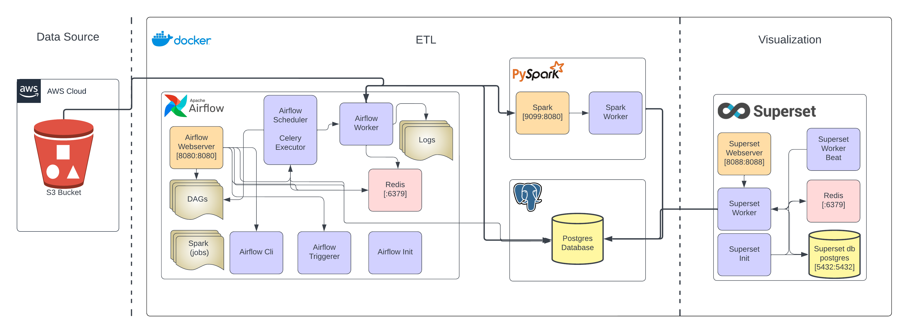

# Bigdata-Processing-pipeline


## Directory Structure
```https://gist.github.com/ericmjl/27e50331f24db3e8f957d1fe7bbbe510```
# Big Data Pipeline for Ads Data

## Table of Contents
- [Introduction](#introduction)
- [Features](#features)
- [Data Pipeline Overview](#data-pipeline-overview)
- [Technologies Used](#technologies-used)
- [Getting Started](#getting-started)
  - [Prerequisites](#prerequisites)
  - [Installation](#installation)
- [Usage](#usage)
- [Contributing](#contributing)
- [License](#license)
- [Acknowledgments](#acknowledgments)
- [References](#references)

## Introduction

Welcome to the Advertisement Data Big Data Pipeline project! In today's digital landscape, advertisements are a critical component of reaching target audiences effectively. This project aims to provide an efficient and comprehensive solution for managing and analyzing advertisement data. This README will guide you through the project's purpose, goals, features, and the technologies used.

**Why the Big Data Pipeline is Necessary for Ads Data**

Advertisement data, including details on job postings, advertisers, and user interactions, is vast and rapidly changing. To derive valuable insights, it's crucial to have a robust pipeline for the following reasons:

- **Data Volume:** The sheer volume of advertisement data makes manual analysis impractical. A Big Data pipeline can efficiently process large datasets, saving time and resources.

- **Real-time Updates:** Advertisements are dynamic, with frequent updates. The pipeline ensures that the most recent data is available for real-time analysis.

- **Data Variety:** Ad data includes structured and unstructured information, making diversity a challenge. The pipeline is designed to handle this diversity effectively.

**Main Goals and Objectives**

The primary goals of our project are:

1. **Efficient Data Handling:** Develop a pipeline capable of efficiently handling and processing vast amounts of advertisement data.

2. **Data Transformation:** Transform raw data into a structured and organized format suitable for analysis.

3. **Real-time Updates:** Enable real-time updates to ensure that the data used for analysis is up-to-date.

4. **Data Anonymization:** Protect user privacy by anonymizing sensitive information in compliance with data regulations.

5. **Scalability:** Design a pipeline that can scale horizontally to accommodate increasing data volumes and processing demands.

## Features

Our Big Data pipeline boasts several key features and capabilities:

- **Scalability:** The pipeline is designed to scale horizontally, ensuring it can accommodate growing data volumes and processing demands effectively.

- **Real-time Updates:** Data updates are captured and processed in real-time, guaranteeing that analyses are based on the latest information.

- **Data Anonymization:** Sensitive user data is anonymized to comply with data protection regulations and maintain privacy.

- **Flexibility:** The pipeline is adaptable to changes in data schema and format, ensuring it remains robust in dynamic environments.

- **Efficient Processing:** We leverage technologies like Apache Spark for distributed data processing, optimizing efficiency.

## Data Pipeline Overview

Our data pipeline is designed to efficiently process and manage large volumes of advertisement data.
It consists of several key components, including Apache Spark for data processing, Apache Airflow for workflow orchestration, and PostgreSQL for data storage.
The pipeline starts by collecting data from multiple sources, including AWS S3 buckets and external APIs. This raw data is then transformed and cleaned using Spark, ensuring it's ready for analysis. Apache Airflow schedules and coordinates these tasks, making the pipeline robust and scalable. The final output is stored in a PostgreSQL database, where it can be accessed for various analytical purposes. This high-level overview illustrates how data flows seamlessly through our system, from ingestion to storage and analysis.



## Technologies Used

Our project harnesses a range of technologies, frameworks, and libraries to create an effective Big Data pipeline:

- **Apache Spark:** Used for distributed data processing, Apache Spark ensures efficient handling of large datasets. [Official Documentation](https://spark.apache.org/documentation.html)

- **PostgreSQL:** This relational database management system serves as our data warehouse, providing reliable data storage and retrieval. [Official Documentation](https://www.postgresql.org/docs/)

- **Apache Airflow:** The pipeline is orchestrated and automated using Apache Airflow, facilitating smooth data workflow management. [Official Documentation](https://airflow.apache.org/docs/apache-airflow/stable/index.html)

- **Docker:** Docker containers are employed to ensure consistent and reliable deployment across various systems. [Official Documentation](https://docs.docker.com/)

- **Python:** Python programming language is used for scripting and integrating various components of the pipeline. [Official Documentation](https://docs.python.org/)

## Getting Started
### Prerequisites

To run this project successfully, you need to meet certain prerequisites and dependencies. Ensure that the following requirements are in place:

**1. Ubuntu System:** This project is designed for use on an Ubuntu operating system. Make sure you have access to an Ubuntu-based system.

**2. Docker Installed:** Docker is a containerization platform that we use for consistent deployment. You must have Docker installed on your system. You can find installation instructions for Docker [here](https://docs.docker.com/get-docker/).

With these prerequisites in place, you'll be ready to set up and run the Advertisement Data Big Data Pipeline successfully.

Stay tuned for installation instructions and usage guidelines in our README file.

### Installation
#### 1. Clone the Repository
First, clone the project repository from GitHub to your local machine. You can do this by running the following command in your terminal:
```bash
git clone https://github.com/maherahmedraza/Bigdata-Processing-pipeline.git
```
#### 2. Start the Pipeline
Once you have cloned the repository, navigate to the project's directory in your terminal:

```bash
cd Bigdata-Processing-pipeline
```

Then, start the pipeline using Docker Compose:

```bash
docker-compose up
```
This command will initiate the Big Data pipeline and prepare it for use.

#### 3. Start Superset Services

To start the Superset services for data visualization and exploration, use the following command:

```bash
sudo docker-compose -f superset/docker-compose.yml up
```
This will launch Superset and make it available for use.

## Usage
Here's how you can use the Advertisement Data Big Data Pipeline:

- **Apache Airflow URL:** You can access Apache Airflow's web interface at [http://localhost:8080/](http://localhost:8080/).

  - **Username:** airflow
  - **Password:** airflow

  Apache Airflow provides a centralized platform for managing and scheduling your data workflows.

- **Spark Master Web UI:** For monitoring and managing Apache Spark, you can use the Spark Master Web UI at [http://localhost:9099/](http://localhost:9099/).

  This web interface allows you to view and manage Spark clusters and jobs.

- **Superset:** To explore and visualize your data, Superset is available at [http://localhost:8088/](http://localhost:8088/).

  - **Username:** admin
  - **Password:** admin

  Superset is a powerful data exploration tool that lets you create interactive and insightful data visualizations.

Now that you've set up the project and know how to access the different components, you can begin using the Advertisement Data Big Data Pipeline for your data processing and analysis needs.

## Contributing

We welcome contributions to the Advertisement Data Big Data Pipeline project. If you'd like to contribute, please follow these guidelines:

1. Fork the repository.
2. Create a new branch for your feature or bug fix: `git checkout -b feature-name`
3. Make your changes and test thoroughly.
4. Commit your changes: `git commit -m "Add a brief description of your changes"`
5. Push your branch to your forked repository: `git push origin feature-name`
6. Open a pull request to the `main` branch of this repository.

Please follow our coding standards and collaborate respectfully with other contributors.

## License

This project is licensed under the [MIT License](LICENSE).

You are free to use this project, but please refer to the [LICENSE](LICENSE) file for details and any terms and conditions.

## Acknowledgments

We would like to acknowledge the following:

- The open-source community for providing valuable tools and technologies.
- The contributors who have helped improve this project.
- Any libraries or tools used in this project, which have been instrumental in its success.

## References

- Bitnami. (n.d.). Docker Hub: Bitnami Spark. Docker Hub. https://hub.docker.com/r/bitnami/spark/

- Apache Superset. (n.d.). Installing Superset using Docker Compose. Apache Superset Documentation. https://superset.apache.org/docs/installation/installing-superset-using-docker-compose

- DigitalOcean. (n.d.). How To Remove Docker Images, Containers, and Volumes. DigitalOcean Tutorials. https://www.digitalocean.com/community/tutorials/how-to-remove-docker-images-containers-and-volumes

- Apache Airflow. (n.d.). Docker Hub: Apache Airflow. Docker Hub. https://hub.docker.com/r/apache/airflow

- Apache Airflow. (n.d.). Extending the Official Airflow Docker Images. Apache Airflow Documentation. https://airflow.apache.org/docs/docker-stack/build.html#extending-the-image

- Apache Airflow. (n.d.). Installation — Apache Airflow Documentation. https://airflow.apache.org/docs/apache-airflow/stable/installation/index.html#using-production-docker-images

- Neves, A. (n.d.). andrejnevesjr/airflow-spark-minio-postgres. GitHub. https://github.com/andrejnevesjr/airflow-spark-minio-postgres

- Finloop. (n.d.). airflow-postgres-superset-on-docker. GitHub. https://github.com/finloop/airflow-postgres-superset-on-docker

- Hasan, M. K. (n.d.). Dockerized-Airflow-Spark. GitHub. https://github.com/mk-hasan/Dockerized-Airflow-Spark

- Apache Airflow. (n.d.). Overview — Apache Airflow Documentation. https://airflow.apache.org/docs/apache-airflow/stable/core-concepts/overview.html

- Apache Airflow. (n.d.). Adding Packages from requirements.txt. Docker Hub. https://airflow.apache.org/docs/docker-stack/build.html#adding-packages-from-requirements-txt

- Docker Documentation. (n.d.). docker exec. Docker Documentation. https://docs.docker.com/engine/reference/commandline/exec/

- Apache Spark. (n.d.). Spark Configuration. Apache Spark Documentation. https://spark.apache.org/docs/latest/configuration.html

- Spark by Examples. (n.d.). PySpark Tutorial. Spark by Examples. https://sparkbyexamples.com/pyspark-tutorial/
